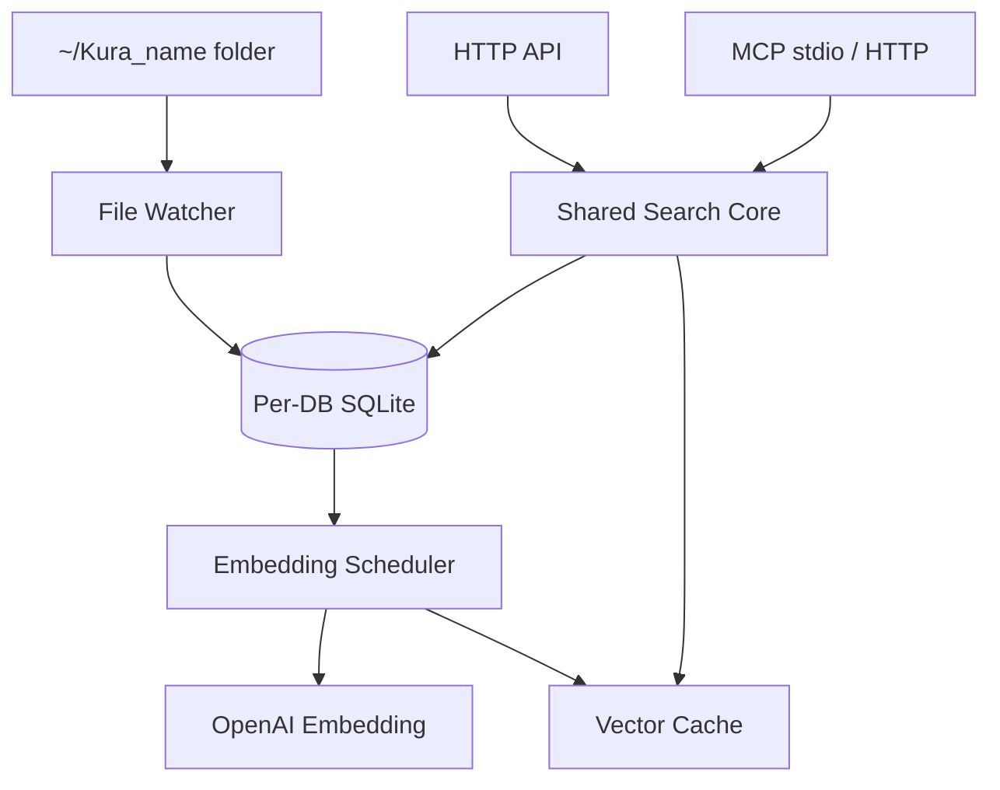

> [!NOTE]
> This README was generated by [SKILL](https://github.com/agenvoy/skill-readme-generate), get the ZH version from [here](./doc/README.zh.md).

***

<strong>DROP FILES IN, LET YOUR AGENT SEARCH THEM OUT</strong>

***

> A Go read-only RAG database with drop-in auto-indexing, parallel keyword and semantic search, and MCP tools

## Table of Contents

- [Features](#features)
- [Architecture](#architecture)
- [License](#license)
- [Author](#author)

## Features

> `git clone https://github.com/agenvoy/kuradb.git && cd kuradb && make app` · [Documentation](./doc/doc.md)

- **Drop-In Indexing** — Drop files into `~/Kura_{name}` and the watcher parses PDF, DOCX, PPTX, CSV, XLSX, and plain text, queues them for embedding, and soft-deletes removed files.
- **Parallel Keyword + Semantic Search** — Each request runs gse-tokenized keyword matching and OpenAI embedding search concurrently, returning results grouped by source file.
- **Two-Stage Vector Retrieval** — Source-level mean vectors shortlist candidate files, then candidate chunks are scored with parallel cosine and filtered by a similarity floor.
- **One-Way Write Boundary** — The API exposes queries only; the sole write path is watcher → parser → SQLite, and changed content invalidates stale embeddings automatically.
- **Native MCP Tools** — `kura mcp` serves `list_rag` and `search_rag` over stdio, and `kura remote enable` exposes the same tools over HTTP at `/mcp`.

## Architecture

> [Full Architecture](./doc/architecture.md)

## License

This project is licensed under the [MIT LICENSE](LICENSE).

## Author

Just [open an issue](https://github.com/agenvoy/kuradb/issues/new) to share an idea.

***

©️ 2026 [邱敬幃 Pardn Chiu](https://www.linkedin.com/in/pardnchiu)
