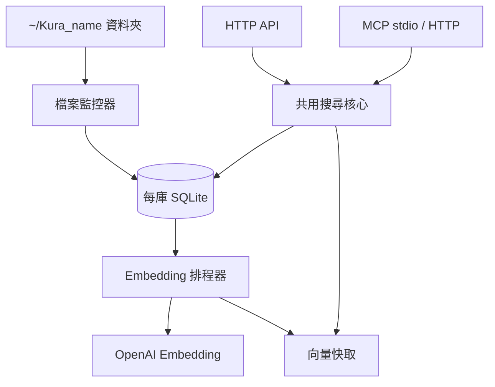

> [!NOTE]
> 此 README 由 [SKILL](https://github.com/agenvoy/skill-readme-generate) 生成，英文版請參閱 [這裡](../README.md)。

***

<strong>DROP FILES IN, LET YOUR AGENT SEARCH THEM OUT</strong>

***

> Go 唯讀 RAG 資料庫服務，具備拖放自動索引、關鍵字與語意並行搜尋與 MCP 工具介面

## 目錄

- [功能特點](#功能特點)
- [架構](#架構)
- [授權](#授權)
- [Author](#author)

## 功能特點

> `git clone https://github.com/pardnchiu/KuraDB.git && cd KuraDB && make app` · [完整文件](./doc.zh.md)

- **拖放即索引** — 把檔案丟進 `~/Kura_{name}` 資料夾，watcher 自動解析 PDF／DOCX／PPTX／CSV／XLSX／純文字並排入 embedding，刪檔即軟刪除。
- **關鍵字與語意並行搜尋** — 同一請求平行執行 gse 中文斷詞關鍵字比對與 OpenAI embedding 向量搜尋，結果依來源檔分組回傳。
- **兩階段向量檢索** — 先以來源平均向量篩出候選檔，再對候選區塊平行計算 cosine，並以相似度門檻濾除雜訊。
- **單向寫入的唯讀邊界** — 對外只有查詢端點，寫入唯一路徑為 watcher → parser → SQLite，內容變更時自動作廢舊向量。
- **原生 MCP 工具** — `kura mcp` 以 stdio 提供 `list_rag`／`search_rag`，亦可透過 `kura remote enable` 在 HTTP `/mcp` 上開放。

## 架構

> [完整架構](./architecture.zh.md)

## 授權

本專案採用 [MIT LICENSE](../LICENSE)。

## Author

Just [open an issue](https://github.com/pardnchiu/KuraDB/issues/new) to share an idea.

***

©️ 2026 [邱敬幃 Pardn Chiu](https://www.linkedin.com/in/pardnchiu)
