# kuradb - Architecture

> Back to [README](../README.md)

## Overview

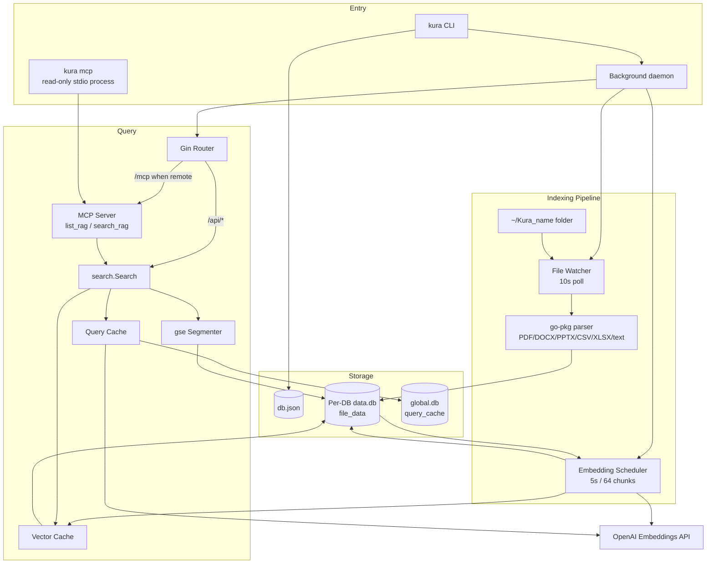

## Module: cmd/app (Entry and Lifecycle)

Dispatches CLI subcommands, forks the daemon, or starts MCP over stdio based on arguments.

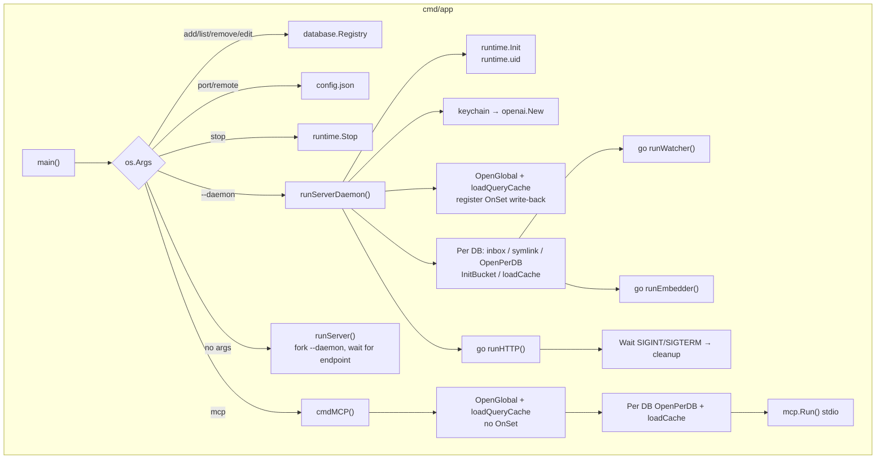

## Module: internal/filesystem (Watching and Parsing)

Recursively diffs the inbox against a size + mtime snapshot, dispatches changed files to parsers by extension, and recursively soft-deletes vanished files.

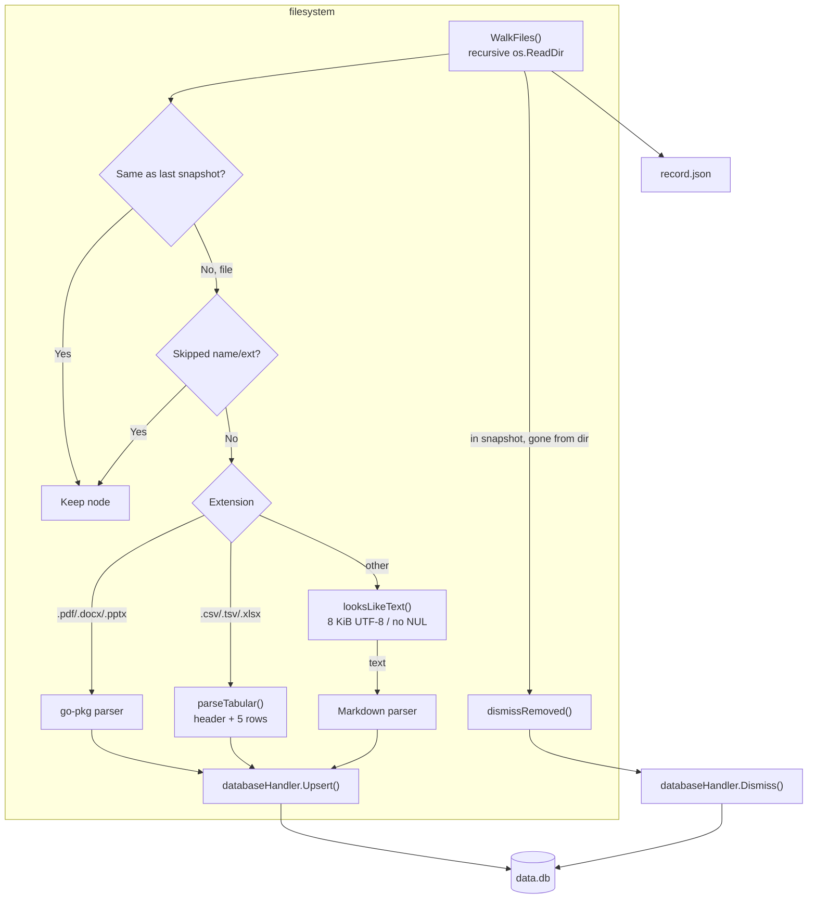

## Module: internal/database (Data Layer)

`go-sqlkit` manages split read/write connections; handlers are the only SQLite write entry point.

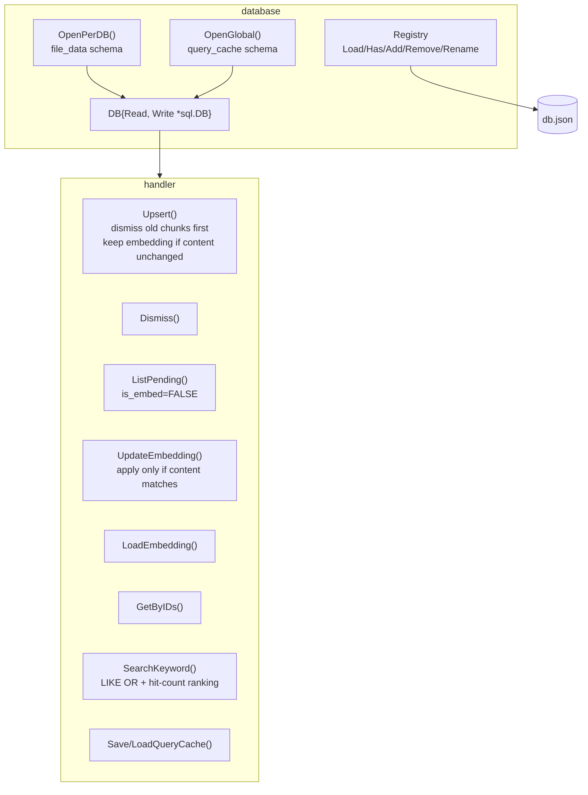

### file_data

| Column | Type | Description |
|--------|------|-------------|
| `id` | INTEGER PK | Primary key |
| `source` | TEXT | Absolute source file path |
| `chunk` | INTEGER | Chunk index |
| `total` | INTEGER | Total chunks for the file |
| `content` | TEXT | Chunk content |
| `embedding` | BLOB | 512-dim float32, little-endian |
| `is_embed` | BOOLEAN | Embedded flag |
| `dismiss` | BOOLEAN | Soft-delete flag |
| `created_at` / `updated_at` | TIMESTAMP | Timestamps |

Constraint `UNIQUE (source, chunk)`; index `idx_file_data_source` and partial index `idx_file_data_pending` (`is_embed = FALSE AND dismiss = FALSE`).

### query_cache

| Column | Type | Description |
|--------|------|-------------|
| `query` | TEXT PK | Query string |
| `embedding` | BLOB | Query vector |
| `created_at` | TIMESTAMP | Write time |

## Module: internal/openai (Embedding Client and Query Cache)

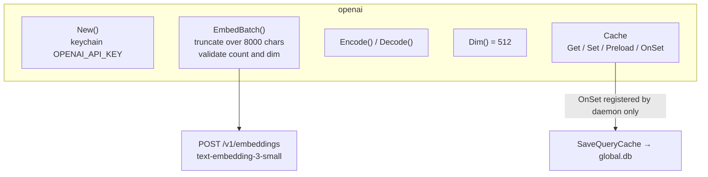

## Module: internal/vector (Vector Cache)

One bucket per database; fully rebuilt from SQLite and never authoritative.

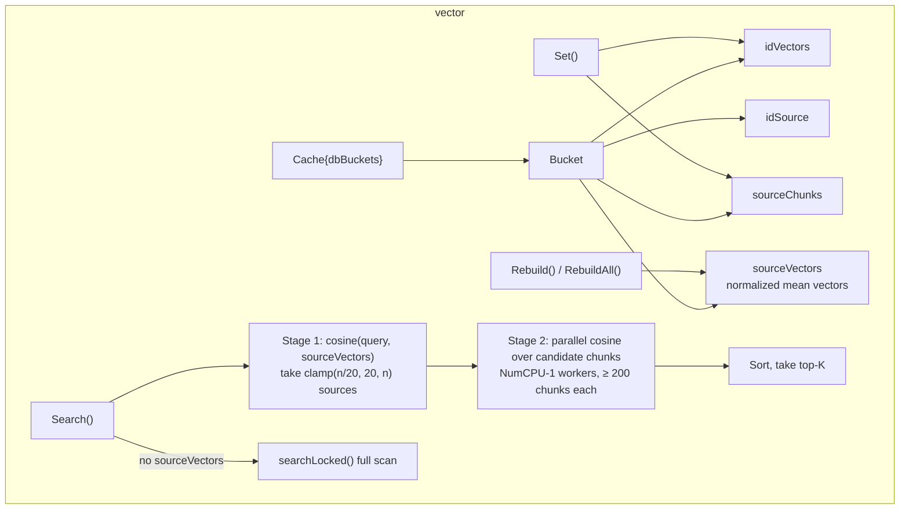

## Module: internal/search and internal/mcp (Shared Query Core)

HTTP and MCP share `search.Search`, keeping behavior identical across both surfaces.

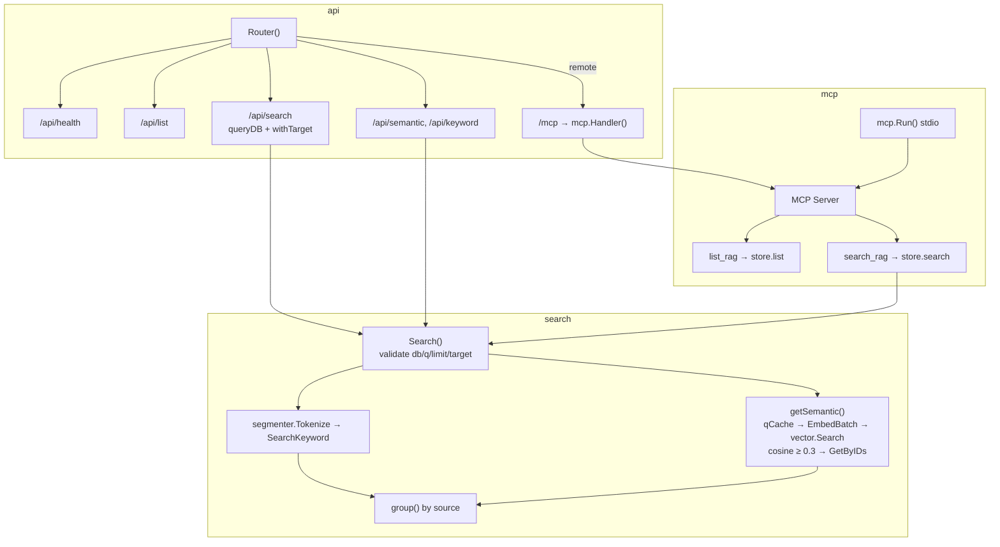

## Data Flow: File Indexing

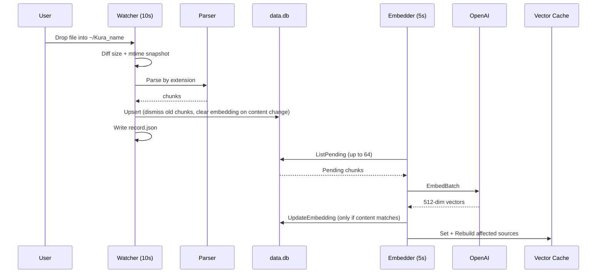

## Data Flow: Search

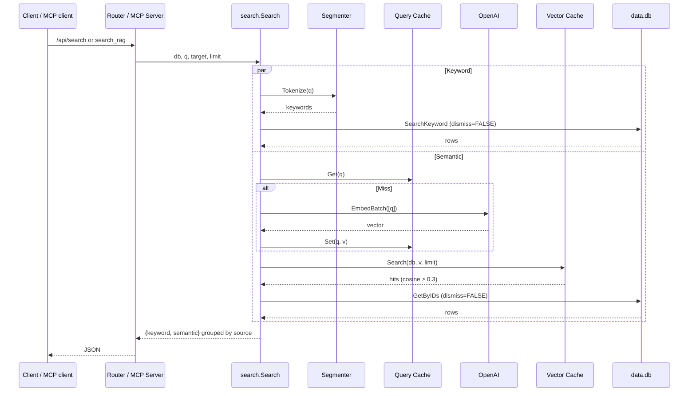

## State Machine: Chunk Lifecycle

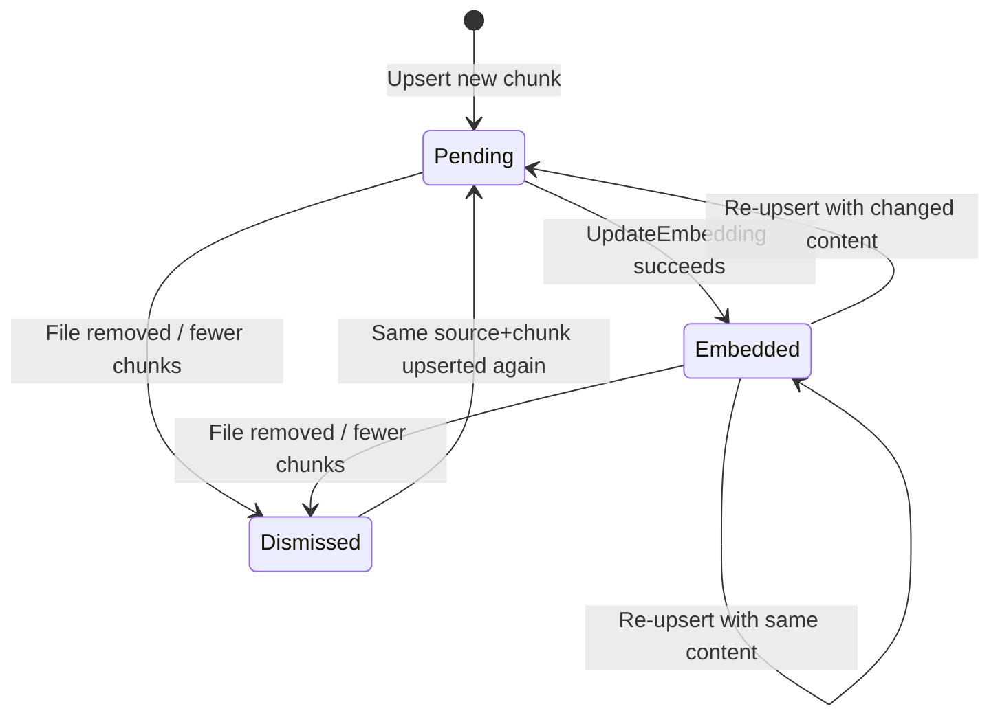

## State Machine: Daemon

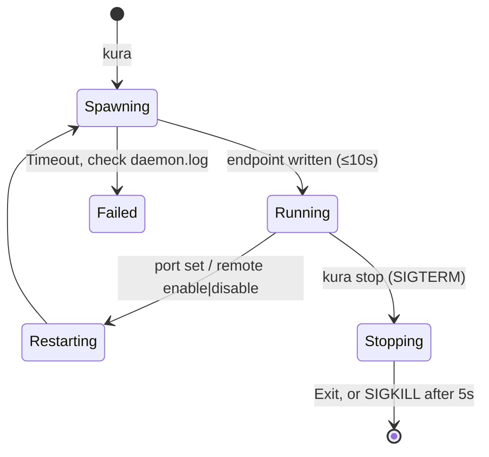

***

©️ 2026 [邱敬幃 Pardn Chiu](https://www.linkedin.com/in/pardnchiu)
