# kuradb - 架構

> 返回 [README](./README.zh.md)

## 概覽

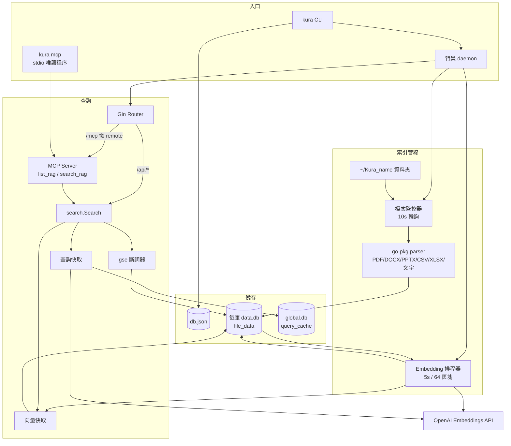

## 模組：cmd/app（入口與生命週期）

依參數分派 CLI 子指令、fork daemon，或以 stdio 啟動 MCP。

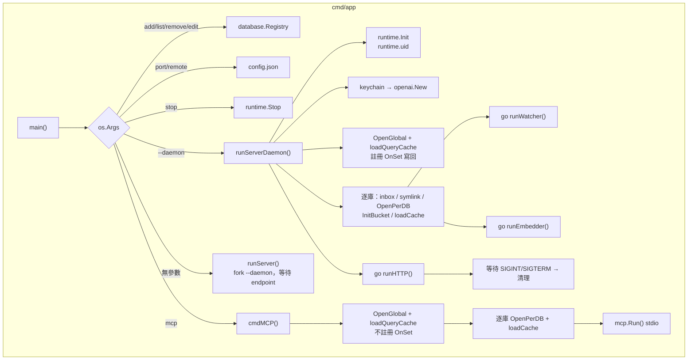

## 模組：internal/filesystem（監控與解析）

以 size + mtime 快照遞迴比對 inbox，變更檔依副檔名分派 parser，消失的檔案遞迴軟刪除。

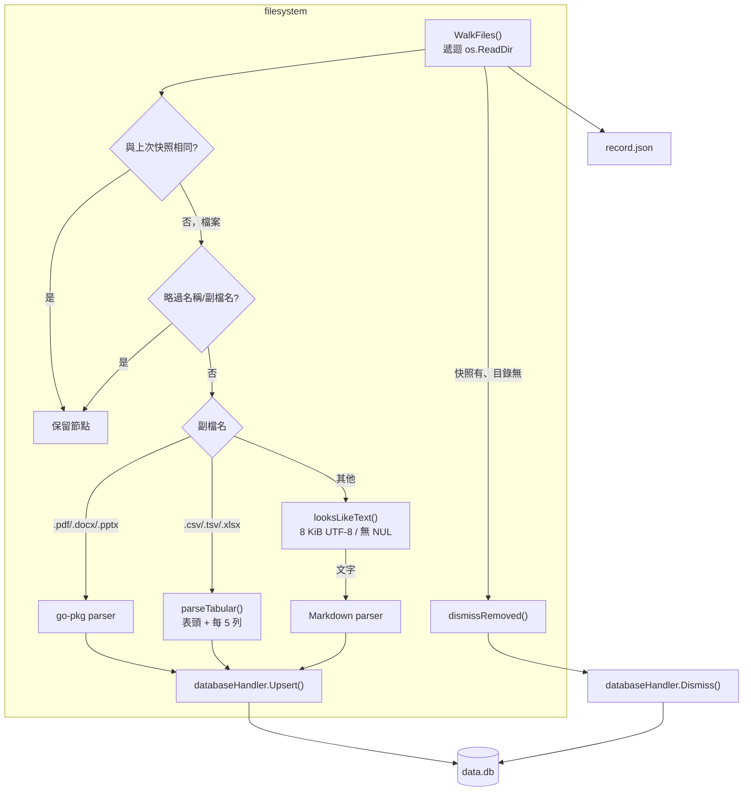

## 模組：internal/database（資料層）

`go-sqlkit` 管理讀寫分離連線；handler 為 SQLite 唯一寫入入口。

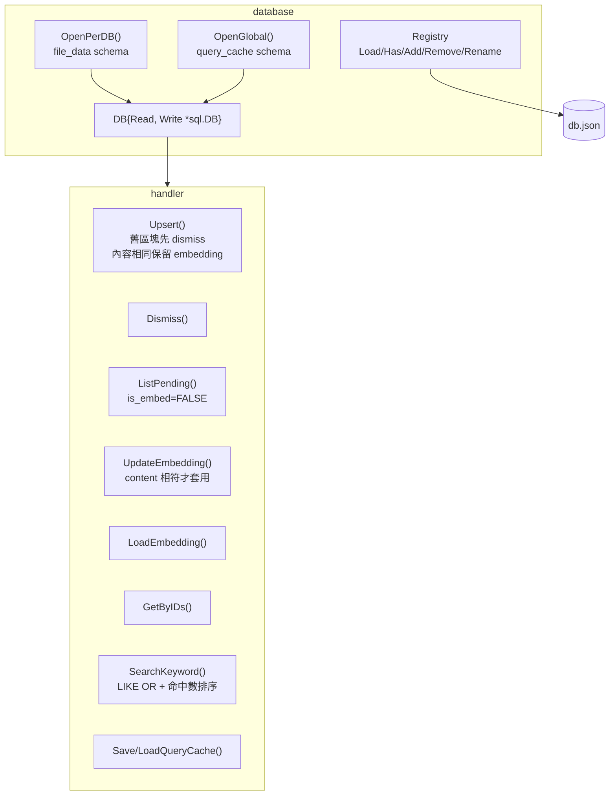

### file_data

| 欄位 | 型別 | 說明 |
|------|------|------|
| `id` | INTEGER PK | 主鍵 |
| `source` | TEXT | 來源檔絕對路徑 |
| `chunk` | INTEGER | 區塊序號 |
| `total` | INTEGER | 該檔總區塊數 |
| `content` | TEXT | 區塊內容 |
| `embedding` | BLOB | 512 維 float32 little-endian |
| `is_embed` | BOOLEAN | 是否已嵌入 |
| `dismiss` | BOOLEAN | 軟刪除 |
| `created_at` / `updated_at` | TIMESTAMP | 時間戳 |

約束 `UNIQUE (source, chunk)`；索引 `idx_file_data_source`、部分索引 `idx_file_data_pending`（`is_embed = FALSE AND dismiss = FALSE`）。

### query_cache

| 欄位 | 型別 | 說明 |
|------|------|------|
| `query` | TEXT PK | 查詢字串 |
| `embedding` | BLOB | 查詢向量 |
| `created_at` | TIMESTAMP | 寫入時間 |

## 模組：internal/openai（Embedding 客戶端與查詢快取）

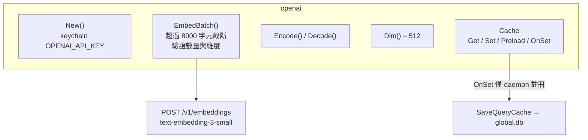

## 模組：internal/vector（向量快取）

每庫一個 Bucket；由 SQLite 全量重建，非權威資料源。

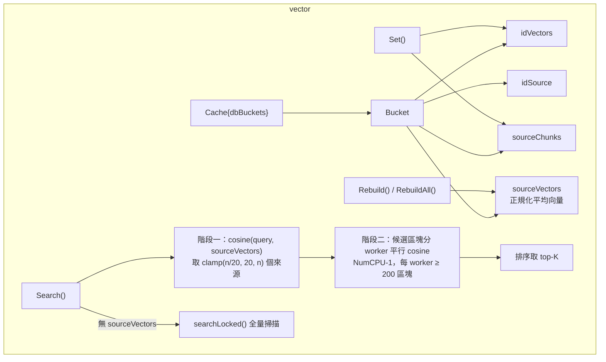

## 模組：internal/search 與 internal/mcp（共用查詢核心）

HTTP 與 MCP 共用 `search.Search`，確保兩端行為一致。

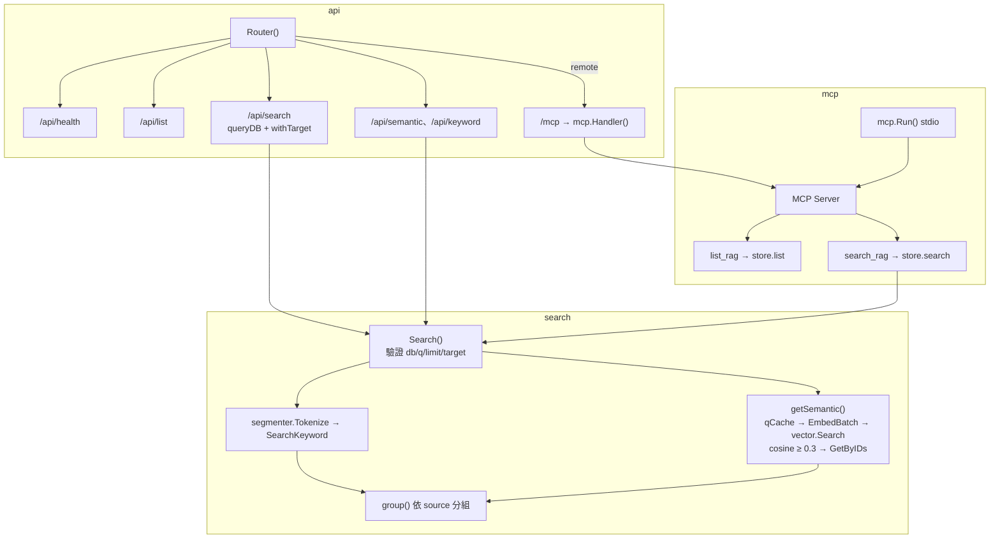

## 資料流：檔案索引

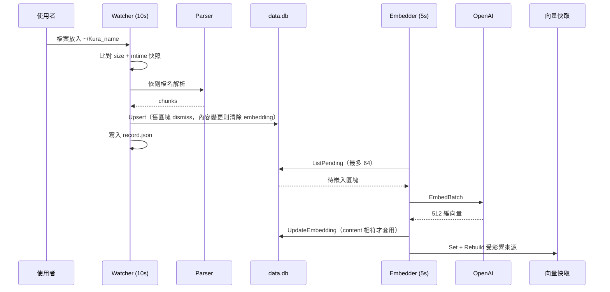

## 資料流：搜尋

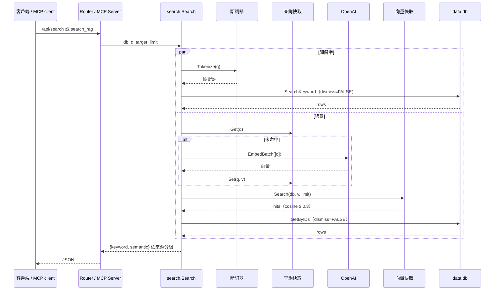

## 狀態機：區塊生命週期

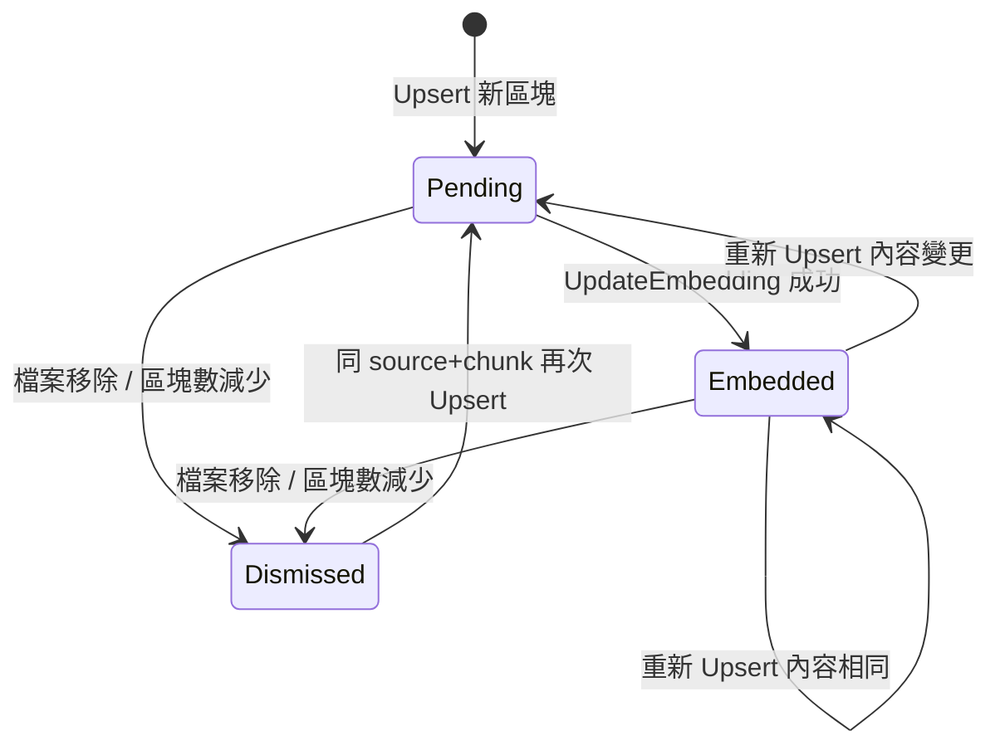

## 狀態機：daemon

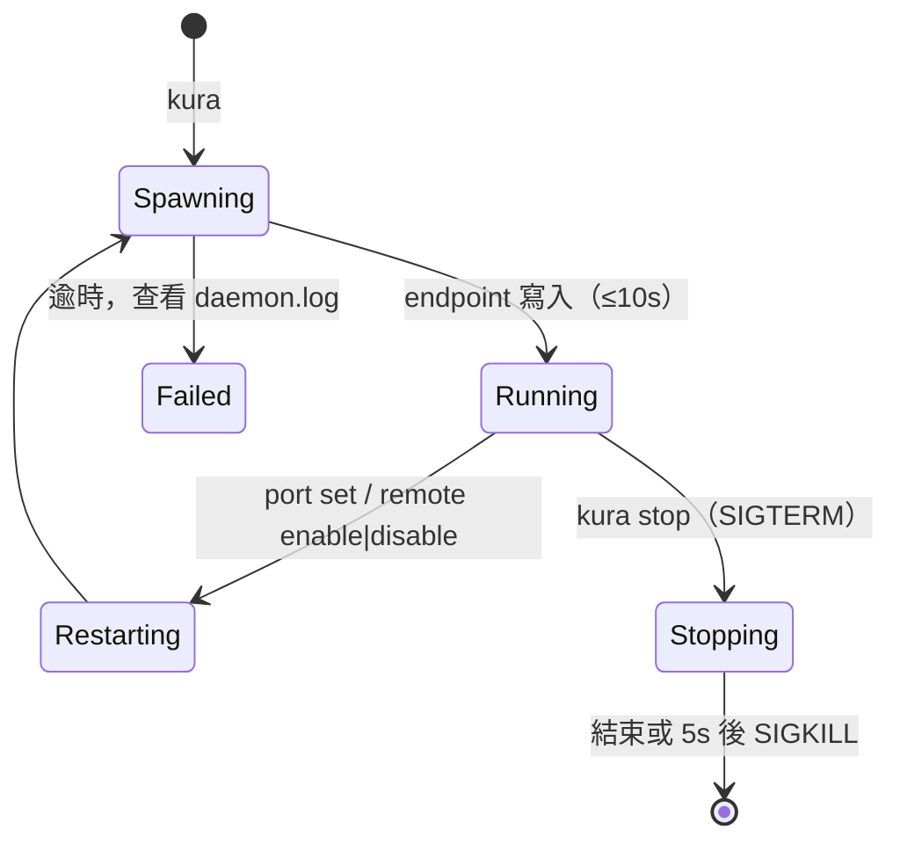

***

©️ 2026 [邱敬幃 Pardn Chiu](https://www.linkedin.com/in/pardnchiu)
